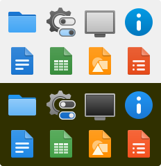

# Haptic Icons

An icon theme for KDE Plasma inspired by Material Design.

This icon theme contains more than 400 individual icons and more than 100 original _Material_ icons.
It falls back to _Breeze_.

## Installation

This icon theme is available at [https://store.kde.org](https://store.kde.org/p/1502575/). It can be installed from there or via KDE system settings. To manually install the icons, copy the _haptic-dark_, _haptic-light_, _material-design-dark_ and _material-design-light_ folders to `~/.local/share/icons`
or `/usr/share/icons`.
